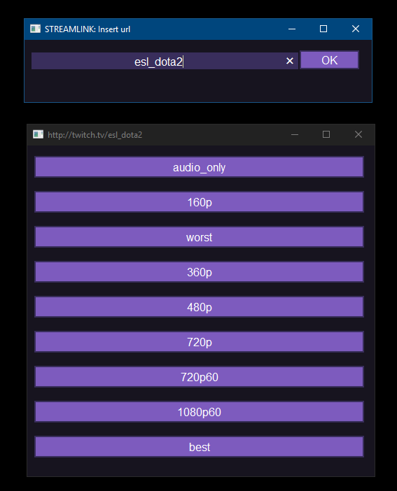

#### Streamlink all-in-one package    
The included MPC-HC video player uses pass-trough and hw acceleration onto your gpu with low resources usage  
Use Middle DblClick to reload stream in MPC-HC if any issues, Left DblClick to switch Fullscreen   
Refactored to hide the command window at launch, show gui dialogs for URL and STREAM as needed  
Detects options like --twitch-oauth-authenticate in url input-dialog and pass it as-is    
  
  
  
#### EXAMPLE USAGE  
Unzip & run `ESL_DOTA2.bat` or `ESL_DOTA2+chat.bat`  
~ __a dialog will ask to select quality__  
~ video will play in MPC-HC (included), Twitch chat will start in a browser tab (only for +chat variant)  
Create new batch scripts for your favourite Twitch streams by simply making a copy of an example batch file  
then rename it to the twitch stream name i.e. `ESL_DOTA2.bat` to `DreamLeague.bat`  
  
#### COMMAND-LINE USAGE  
After first launch, scripts can also be called from any path or [Win+R] run menu:   
STREAMLINK                          _= with no parameters shows stream name input-dialog._   
STREAMLINK esl_dota2                _= with just the url or twitch channel name shows quality choice-dialog._    
STREAMLINK twitch.tv/esl_dota2 720p _= with url or twitch channel name + quality launches video player directly._   
  
Can also Drag & Drop stream url to these batch scripts:  
`streamlink\streamlink.bat`     _=  Streamlink quality dialog hidecmd launcher._   
`streamlink\streamlinkchat.bat` _=  Streamlink quality dialog hidecmd launcher + chat in a browser tab._  
  
#### PLUGIN USAGE:   
Get _'Open With'_ plugin for firefox - https://addons.mozilla.org/en-US/firefox/addon/open-with/  
_'Open With Options'_ - _'Add'_ - set filter _'Applications'_ to _'All files'_ - browse to `streamlink\streamlink.bat`  
Now you can directly right-click stream link in firefox and choose _'Open Link with -- streamlink.bat'_  
